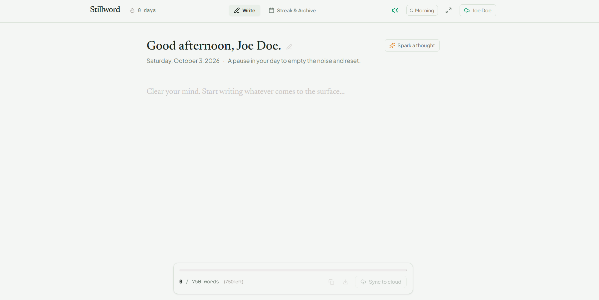
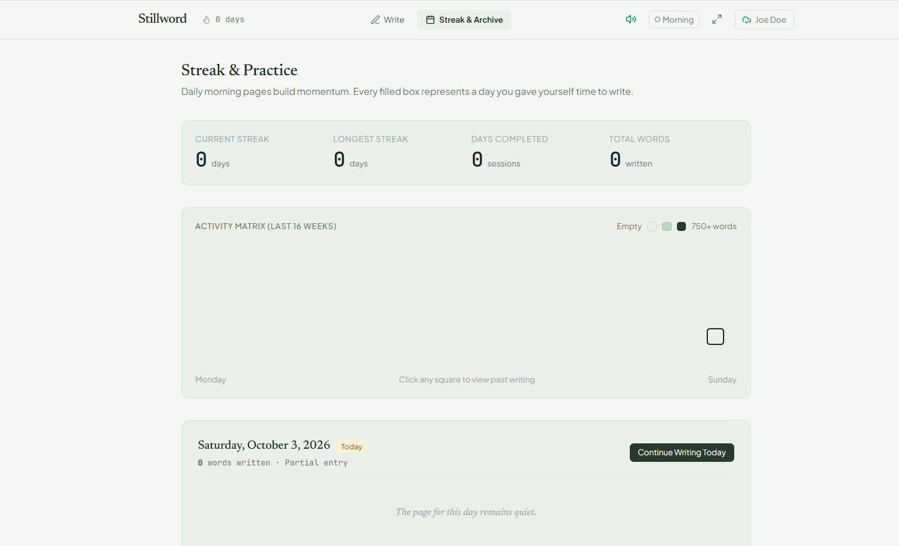
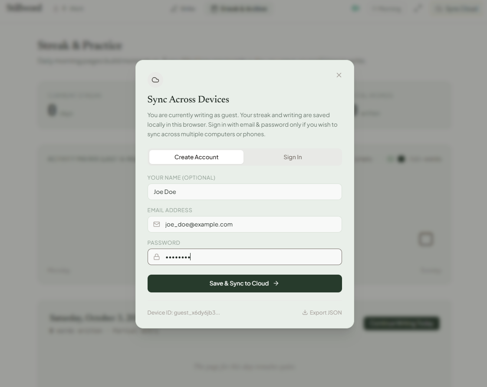

# Stillword

A free and open source alternative to [750words.com](https://750words.com) — a minimal daily writing app focused on helping you build a consistent writing habit.

---

## What is Stillword?

Stillword gives you a quiet, distraction-free space to write every day. The idea is simple: open the app, write whatever is on your mind, and close it. No social features, no public posts, no pressure — just you and the page.

It is inspired by the concept of morning pages, where the goal is to write freely and regularly, not to produce something polished. Writing even a few words counts as a completed day.

---

## Screenshots

---

## Features

- Distraction-free writing editor with a clean, minimal interface
- Daily word count tracker with a 750-word goal indicator (optional, not required to complete a day)
- Streak tracking — see your current streak, longest streak, and total words written
- Streak calendar to visualize your writing history across months
- Multiple themes — Oatmeal, Sage, Ink, and Pure
- Zen mode that fades the UI while you are actively typing
- Writing prompts to help you get started when you are stuck
- Sound effects on keystrokes and goal completion (toggleable)
- Guest mode — works entirely in the browser with no account needed
- Cloud sync — create an account to sync your writing across devices
- Manual sync button to push your entry to the cloud on demand
- Auto-sync every 100 words as a background safety net
- Export your entries as a JSON backup or download individual entries as text files

---

## Guest vs Registered

You can use Stillword without creating an account. Everything is saved locally in your browser. If you later create an account, your existing local entries are automatically migrated to the cloud.

Registered users get cloud sync backed by AWS (DynamoDB for metadata, S3 for entry content). A refresh always pulls the latest content from the cloud.

---

## Getting Started

Install dependencies and start the development server:

- Install Node.js (v18 or later)
- Run `npm install` in the project root
- Copy `.env.example` to `.env` and fill in your Lambda URL if you want cloud sync
- Run `npm run dev` to start the app locally

For a production build, run `npm run build`. The app is a static site and can be deployed to Netlify or any static host.

---

## Backend

The backend lives in a separate repository. It is a single AWS Lambda function (Python) with a Function URL, backed by DynamoDB and S3. See the backend repo for setup instructions.

---

## License

MIT
